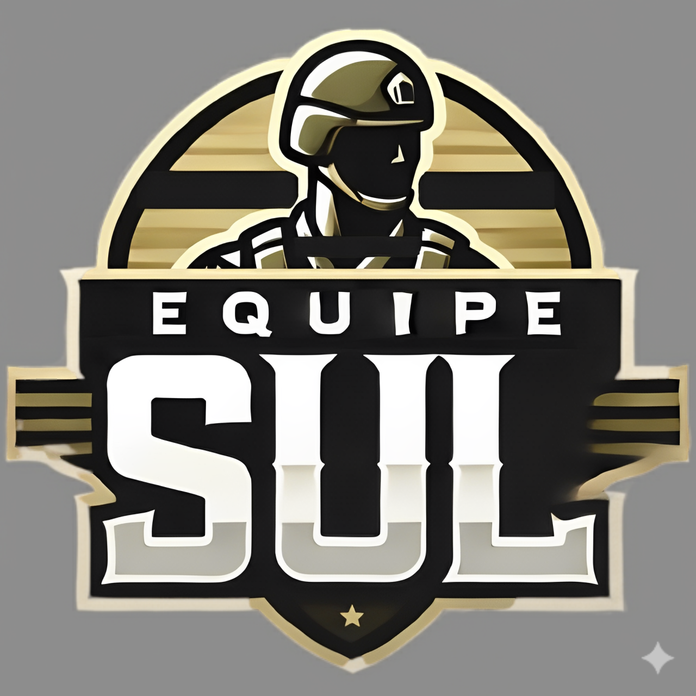

# API 3º Semestre ADS

## Entrenova Flix - EntreNova

## Documentação - Sprint 2

      
      <h2 align="center"> Equipe Sul</h2>

  | <a href ="#desafio"> Desafio</a>  |
  <a href ="#us"> User Stories</a>  |   
  <a href ="#dor">DoR</a>  |
  <a href ="#dod">DoD</a>  |
  <a href ="#equipe"> Equipe</a> |

> Status da Sprint: Em andamento 

| Rank | User Story | Descrição | Valor de Produto | Estimativa | Prioridade |
|------|------------|-----------|------------------|------------|------------|
| 1 | US7 | Como usuário, quero criar minha conta e acessar a plataforma com login e senha, para visualizar relatórios e trilhas de forma segura. | Garante acesso privado, aumenta confiança do usuário e permite histórico de trilhas. | 8 | 🟠 **Alto** |
| 2 | US9 | Como RH, quero criar, editar e deletar usuários/funcionários, para que eles possam acessar a plataforma corretamente. | Permite controlar e vincular relatórios e trilhas aos funcionários corretos. | 8 | 🟠 **Alto** |
| 3 | US10 | Como usuário, quero acessar minha página principal de acordo com meu perfil, para visualizar relatórios, progresso e trilhas. | Oferece experiência personalizada e facilita acesso às informações relevantes. | 8 | 🟠 **Alto** |
| 4 | US8 | Como administrador da Entrenova, quero definir perfis de usuários (RH, funcionário, visitante), para que cada um tenha acesso apenas às suas funcionalidades. | Garante segurança e organização de permissões. | 5 | 🟠 **Alto** |
| 5 | US11 | Como administrador da Entrenova, quero visualizar um geral de empresas e progresso de trilhas, para acompanhar o uso da plataforma. | Permite que a Entrenova evolua a experiência das empresas na plataforma, com base em relatórios gerenciais resumidos para tomada de decisão.  | 5 | 🔵 **Médio** |

## 🏃‍ DoR - Definition of Ready 

* **Descrição clara:** A user story está escrita de forma compreensível. 
* **Critérios de aceitação definidos:** Cada US tem critérios testáveis (como você já fez).
* **Dependências identificadas:** Não existem bloqueios externos (tecnologia,
banco de dados, etc.) sem solução. 
* **Estimativa feita:** Pontos de esforço foram atribuídos
* **Prioridade definida:** O valor de negócio está claro para a equipe. 
* **Material de referência disponível:** Qualquer documento extra necessário (ex.:
PDF com explicação do fluxo de leads e dimensões) está disponível. 

## 🏆 DoD - Definition of Done 

* Funcionalidade implementada
* Critérios de aceitação atendidos
* Testes realizados
* Documentação mínima atualizada
* Integração concluída
* Validação do PO ou responsável

## 🎓 Equipe 

  <table>
    <tr>
      <th>Membro</th>
      <th>Função</th>
      <th>Github</th>
      <th>Linkedin</th>
    </tr>
    <tr>
      <td>Gustavo Moreira</td>
      <td>Product Owner</td>
      <td></td>
      <td></td>
    </tr>
    <tr>
      <td>Uanderson Leonardo</td>
      <td>Scrum Master</td>
      <td></td>
      <td></td>
    </tr>
    <tr>
      <td>Celso Moreira</td>
      <td>Desenvolvedor</td>
      <td></td>
      <td></td>
    </tr>
    <tr>
      <td>Rodolfo Corbalan</td>
      <td>Desenvolvedor</td>
      <td></td>
      <td></td>
    </tr>
    <tr>
      <td>Vivian Santos</td>
      <td>Desenvolvedor</td>
      <td></td>
      <td></td>
    </tr>
    <tr>
      <td>Leo Naito</td>
      <td>Desenvolvedor</td>
      <td></td>
      <td></td>
    </tr>
    <tr>
      <td>Lincoln Borsoi</td>
      <td>Desenvolvedor</td>
      <td></td>
      <td></td>
    </tr>
  </table>

